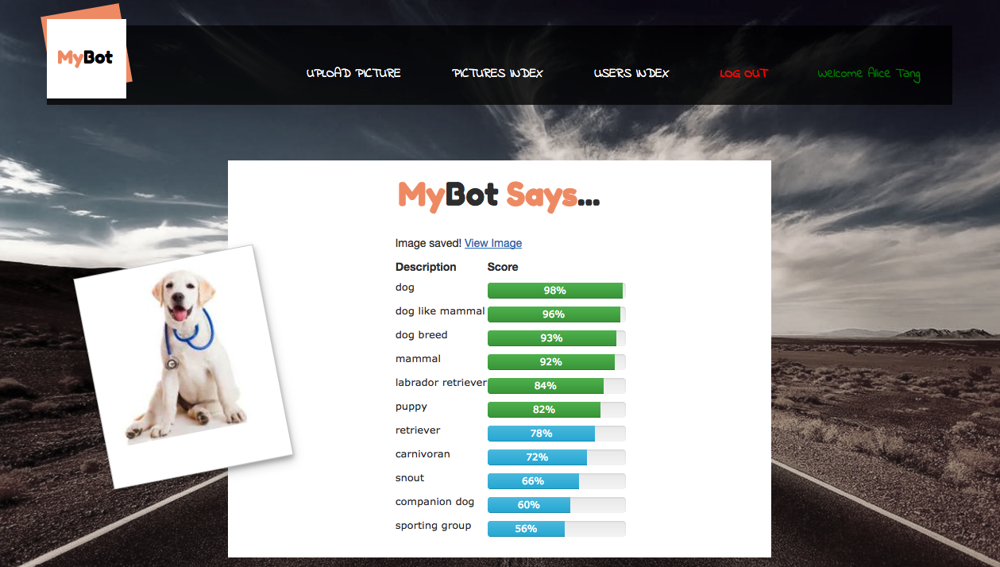

# MyBot - General Assembly Final Project

##Overview
MyBot is a full stack web application where users can drag and drop a picture to browser tab, and MyBot will give you descriptions of the picture and score of each description.

When users drag and drop a picture in browser tab, it triggers file upload to Rails backend via jQuery AJAX post. Then rails sends the file directly to Google Cloud Vision API , gets the response and sends it back to the browser.

Here is the live site [check it out](https://mybot22.herokuapp.com)

## Built with
Ruby on Rails, jQuery ajax, Cloudinary, Google Cloud Vision API, SCSS

##Author
Alice Tang
